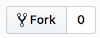
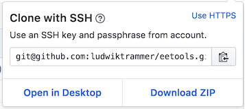
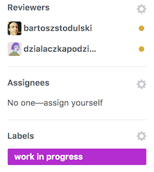
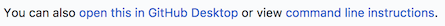
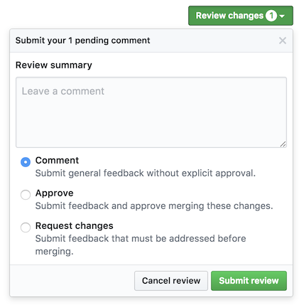
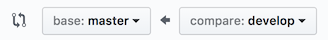

# Przewodnik po gicie w Laboratorium EE (wersja konsolowa)

## Zanim zaczniesz
Poniższy przewodnik zakłada, że znasz i rozumiesz podstawowe pojęcia związane z gitem (takie jak *branch*, *commit*, *merge* czy *pull request*). Jeśli jednak tak nie jest, skorzystaj najpierw z materiałów przedstawiających tę technologię, na przykład:
* Prezentacja "git – prosty przewodnik" ([po polsku](https://rogerdudler.github.io/git-guide/index.pl.html) lub [po angielsku](https://rogerdudler.github.io/git-guide/)).
* Szybki tutorial przygotowany przez GitHub ([po angielsku](https://try.github.io)).
* Kurs "Version Control with Git" na Udacity ([po angielsku](https://www.udacity.com/course/how-to-use-git-and-github--ud775)).

Materiały z których będziesz korzystać mogą przedstawiać sposób z pracy z gitem który w różnych szczegółach różni się od tego, co jest opisane poniżej. W Laboratorium EE zawsze obowiązuje wersja opisana w tym dokumencie. Nie martw się jednak – mechanizmy które poznasz są uniwersalne.

Jeśli z kolei zjadłaś swoje zęby na gicie, a długie opisy Cię nudzą, na początku każdego rozdziału zamieściliśmy wersję **TL;DR** – podsumowanie, które przedstawi Ci najważniejsze informacje przy pomocy kilku słów, które tylko Ty potrafisz zrozumieć ;)

Ta wersja przewodnika wykorzystuje komendy konsoli tekstowej. Żeby ułatwić pracę z gitem osobom w firmie niebędącym programistami, planujemy również alternatywną wersję, opartą na wizualnych narzędziach do obsługi gita.

# Spis treści
* [Rozpoczęcie pracy nad projektem](#rozpoczęcie-pracy-nad-projektem)
* [Dodanie zmian do projektu](#dodanie-zmian-do-projektu)
* [Code review](#code-review)
  * [Dla recenzentów](#dla-recenzentów)
  * [Dla twórców](#dla-twórców)
  * [Mergowanie](#mergowanie)
* [Mergowanie *develop* do *master*](#mergowanie-develop-do-master)
* [Wskazówki do konfiguracji GitHuba](#wskazówki-do-konfiguracji-githuba)

## Rozpoczęcie pracy nad projektem
**TL;DR** Zrób forka, sklonuj go i ustaw *upstream*.

### 1. Stworzenie prywatnego forka
Zanim zaczniesz pracować nad projektem musisz stworzyć swoją własną prywatną kopię jego repozytorium (*fork*). Żeby to zrobić, otwórz stronę głównego repozytorium tego projektu na GutHubie1 i naciśnij przycisk "Fork" znajdujący się w prawej górnej części strony:

Po chwili zostaniesz przekierowana na nowo utworzoną stronę Twojego forka.

1 *Jeśli zamiast strony projektu widzisz błąd 404 lub komunikat o braku dostępu to najprawdopodobniej  nie jesteś zalogowana na GitHubie lub Twoje konto nie zostało jeszcze dodane do GitHubowego zespołu "Laboratorium EE". Zgłoś ten problem [Kazetowi](mailto:krzysztof.zajac@laboratorium.ee ), [Ludwikowi](mailto:ludwik.trammer@laboratorium.ee) lub osobie, która poprosiła Cię o pracę nad projektem.*

### 2. Klon forka
Pobierz kopię repozytorium na swój komputer. W tym celu naciśnij zielony przycisk "Clone or download" na stronie **Twojego prywatnego forka** na GitHubie:

Upewnij się, że w okienku który się pojawi wybrana jest opcja "Clone with SSH" (przełączanie między wersją SSH i HTTPS znajduje się w prawym górnym rogu okienka). Następnie skopiuj adres wyświetlany w polu tekstowym:

Wejdź w konsoli tekstowej na swoim komputerze do katalogu w którym chcesz umieścić kod projektu i wydaj komendę:

    git clone <skopiowany adres git repozytorium>

*Jeśli komenda zwraca błąd mówiący o nieznalezieniu repozytorium lub braku praw dostępu: upewnij się że klucz publiczny którego używasz na danym komputerze został dodany w ustawieniach Twojego konta na GitHubie. Jeśli nie wiesz, co to znaczy lub nie jesteś pewna jak to zrobić, skorzystaj z [instrukcji przygotowanej przez zespół GitHuba](https://help.github.com/articles/connecting-to-github-with-ssh/).*

### 3. Dodanie *upstream*
Kopia repozytorium na Twoim komputerze początkowo połączona jest tylko z Twoim prywatnym forkiem repozytorium projektu. Należy połączyć ją również z głównym repozytorium projektu. W tym celu wejdź na stronę **głównego repozytorium projektu na GitHubie** (czyli tę której adres zaczyna się od "github.com/EE") i skopiuj adres git tego repozytorium znowu korzystając z przycisku "Clone or download".

Następnie w konsoli na swoim komputerze wydaj komendę:

    git remote add upstream <skopiowany adres git repozytorium>

Od tego momentu wydając polecenia gita możesz odwoływać się do tego repozytorium korzystając z nazwy *upstream*. Z kolei do swojego prywatnego forka możesz odwołać się korzystając z nazwy *origin*.

## Dodanie zmian do projektu
**TL;DR** *Zrób nowego brancha bazując na aktualnym branchu *develop*, zrób commita z [porządnym commit message](https://chris.beams.io/posts/git-commit/), wyślij na swojego forka, zrób pull requesta do developa.*

### 1. Przełączenie się na *develop*
W każdym repozytorium w Laboratorium EE powinny istnieć co najmniej dwa branche: *develop* i *master*. Ten pierwszy służy do bieżącej pracy nad projektem. Drugi powinien odzwierciedlać stan kodu projektu, który znajduje się obecnie na serwerze produkcyjnym (lub w przypadku samodzielnych aplikacji: stan kodu ostatnio wydanej wersji). Jako że praca nad projektem odbywa się na branchu *develop*1, na początku upewnij się, że korzystasz obecnie z tego brancha:

    git checkout develop

1 *Od czasu do czasu może przydarzyć się sytuacja, gdy zmiana musi zostać zrobiona bezpośrednio na branchu *master*. Dzieje się tak wtedy, gdy trzeba wydać poprawkę do aktualnie wdrożonej wersji oprogramowania, z pominięciem zmian nad którymi trwa praca w branchu *develop*. Wystarczy wtedy wszędzie w tej instrukcji podmienić nazwę "develop" na "master".*

### 2. Pobranie zmian z głównego repozytorium
Pobierz zmiany z głównego repozytorium projektu, żeby mieć pewność że pracujesz na najnowszej wersji kodu:

    git pull upstream develop --ff-only

Opcja `--ff-only` (*fast-forward only*) powoduje, że git przerwie swoje działanie i wyświetli błąd, jeśli okaże się, że w Twoim lokalnym branchu *develop* znajdują się commity nieobecne w branchu *develop* w głównym repozytorium projektu. Jeśli korzystasz z gita zgodnie z tym przewodnikiem, taka sytuacja nie powinna nigdy wystąpić. Jeśli się pojawi, będzie się wiązać z wcześniejszą pomyłką. Musisz rozwiązać ten problem zanim przejdziesz do dalszej pracy.

### 3. Stworzenie nowego brancha na zmiany
Każda zmiana wysyłana do repozytorium projektu powinna mieć swój własny branch. Żeby go utworzyć wydaj komendę:

    git checkout -b <nazwa_nowego_brancha>

W miejsce `<nazwa_nowego_brancha>` podaj identyfikator nowego brancha. Powinien on nawiązywać do zmian które planujesz, nie przejmuj się jednak za bardzo jego brzmieniem.

**Uwaga!** Nigdy nie wykorzystuj ponownie branchy stworzonych wcześniej do innych zmian. **Każdy pull request powinien przychodzić z własnego, indywidualnego brancha.**

### 4. Wprowadzenie zmian w projekcie
Otwórz swój ulubiony edytor i działaj! 🤞

### 5. Aktualizacja kodu projektu *(opcjonalnie)*
Jeśli w międzyczasie na branchu *develop* w główny repozytorium projektu pojawiły się nowe commity, możesz zaktualizować swój branch, tak żeby również je zawierał. Nie jest to zawsze konieczne, ale dzięki temu będziesz mieć pewność, że Twoje zmiany nadal działają poprawnie z najnowszą wersją kodu projektu. W razie potrzeby możesz robić to wielokrotnie:

    git pull upstream develop --rebase

*Jeśli komenda zwróci komunikat "Your local changes to the following files would be overwritten by merge" oznacza to, że Twoje zmiany dotyczą tych samych plików co zmiany w nowo dodanych commitach. Ukryj na chwilę swoje zmiany przy pomocy komendy `git stash`, ponów komendę `git pull  upstream develop --rebase`, a następnie przywróć swoje zmiany komendą `git stash pop` (jeśli ta ostatnia wyświetla informację "CONFLICT", otwórz pliki podane w komunikacie i rozwiąż w nich konflikty).*

*Jeśli wcześniej już wysyłałaś zmiany z tego brancha do zdalnego repozytorium (przez `git push`) to jednorazowo najbliższy push będzie musiał być wymuszony (`git push --force`). Git wymaga takiego potwierdzenia ze względu na to że operacja rebase zmienia historię w branchu.*

### 6. Kontrola wprowadzonych zmian

Skontroluj status swoich zmian:

    git status

Sprawdź czy wszystko jest w porządku. W szczególności upewnij się, że:

1. Pracujesz na odpowiednim branchu.
2. Lista zmodyfikowanych plików zgadza się z tym czego się spodziewasz.
3. Na liście plików do usunięcia nie ma plików których nie chcesz usunąć.
4. W projekcie nie pojawiły się dodatkowe pliki, które nie powinny trafić do repozytorium.

Następnie skontroluj zmiany wewnątrz plików:

    git diff

Upewnij się, że wszystkie zmiany które widzisz mają sens (i nie są np. zapomnianą pozostałością po Twoich eksperymentach).

### 7. Tworzenie commita
Oznacz zmiany w wybranych plikach jako przeznaczone do najbliższego commita (*staged for commit*):

    git add <lista plików>

Dla wygody możesz użyć komendy `git add .` – oznaczy ona wszystkie pliki w bieżącym katalogu (i podkatalogach).

Następnie stwórz commita:

    git commit

Otworzy się edytor tekstu – na samej górze będzie miejsce na wpisanie przez Ciebie opisu commita. Szczegółowe porady dotyczące pisania dobrych opisów możesz znaleźć [w artykule "How to Write a Git Commit Message"](https://chris.beams.io/posts/git-commit/). Najważniejsze zasady:

1. Pisz po angielsku.
2. Opis powinien zawierać krótkie podsumowanie zmian, a następnie opcjonalnie dłuższy opis oddzielony od podsumowania jedną pustą linią.
3. Podsumowanie musi mieścić się w jednej linijce i nie powinno przekraczać 50 znaków.
4. Podsumowanie powinno zaczynać się od wielkiej litery, ale nie powinno kończyć się kropką.
5. Jeśli commit wynika z ticketu w Jirze, dodaj numer tego ticketu w nawiasie **po podsumowaniu** (dzięki temu commit zostanie automatycznie połączony z ticketem).

Zanim zapiszesz plik, przeczytaj informacje znajdujące się w edytorze tekstu pod spodem – sprawdź czy korzystasz z właściwego brancha (*On branch*) i czy do commita trafią właściwe zmiany (*Changes to be committed* i *Changes not staged for commit*). Jeśli okaże się że coś jest nie tak, zamknij edytor bez zapisywania pliku – anuluje to tworzenie commita.

### 8. Wysyłanie commita
Wyślij commit do swojego prywatnego forka repozytorium na GitHubie:

    git push origin HEAD

*W powyższym zapisie `origin` odnosi się do Twojego prywatnego forka, a `HEAD` spowoduje że commit zostanie wysłany na branch o takiej samej nazwie, jak ten, na którym właśnie pracujesz lokalnie.*

### 9. Stworzenie pull requesta
Wejdź na stronę swojego **prywatnego forka** na GitHubie i kliknij przycisk "New pull request" znajdujący się bezpośrednio ponad listą plików:

Upewnij się, że przy "base fork" wybrany jest branch *develop* głównego repozytorium projektu, a przy "head fork" branch który utworzyłeś specjalnie do tej zmiany na Twoim prywatnym forku.

Jeszcze raz dokładnie przejrzyj znajdującą się poniżej listę zmian.

Jeśli wszystko się zgadza naciśnij przycisk "Create pull request"

To już prawie koniec. Pod "Reviewers" dodaj wszystkie osoby które powinny zrobić code review tych zmian. W dużym polu tekstowym możesz dodać dodatkowe informacje (lub pytania czy wątpliwości) dla osób, które będą czytać Twojego pull requesta.

Jeśli nie jest on jeszcze gotowy do zmergowania i tworzysz go tylko w celu uzyskania opinii na temat wersji roboczej, koniecznie ustaw label "work in progress".

Na koniec ponownie naciśnij zielony przycisk "Create pull request". Gotowe!

## Code review
### Dla recenzentów
**TL;DR** *Dodaj komentarze i wybierz "Approve" lub "Request changes". Bądź uprzejma. Sprawdź ponownie gdy pojawią się zmiany lub odpowiedzi.*

#### Sprawdź zmiany
Otwórz pull request i obejrzyj dokładnie wszystkie zmiany widoczne w karcie "Files changed". Dodatkowo możesz pobrać kod pull requesta na swój komputer i uruchomić go, żeby sprawdzić czy wszystko działa tak jak powinno. Instrukcję, jak to zrobić, znajdziesz pod linkiem "command line instructions" na samym dole karty "Conversation":

Oceń poprawność merytoryczną pull requesta:

* czy rozwiązanie działa i rozwiązuje opisany problem?
* czy rozwiązanie jest spójne z tworzoną aplikacją (wygląd, flow, używane struktury danych)?

Oceń jakość kodu pull requesta:

* czy rozwiązanie jest odpowiednio otestowane? czy nie zmniejsza pokrycia testami?
* czy kod jest czytelny i odpowiednio sformatowany?
* czy kod jest spójny w ramach tworzonej aplikacji?
* czy jest możliwość prostej optymalizacji kodu?
* czy możliwe są inne usprawnienia?

#### Dodaj komentarze i swoją decyzję
Wszystkie swoje uwagi dodaj jako komentarze do konkretnych linii w karcie "Files changed". Wyrażaj się jasno, ale uprzejmie. Dodając pierwszy komentarz zawierdź go przyciskiem "Start a review" – w przeciwnym wypadku stałby się on pojedynczym komentarzem, a nie częścią code review. Gdy skończysz skorzystaj z zieonego przycisku "Review changes" w górnym prawym rogu ekranu:

Wybierz opcję "Approve" jeśli uważasz, że zmiany widoczne w Pull Requeście są gotowe do natychmiastowego włączenia do głównego repozytorium. Jeśli uważasz, że należy coś wcześniej poprawić wybierz opcję "Request changes" (oczywiście wszystkie rzeczy do poprawy powinny zostać wcześniej opisane w komentarzach).

Powtórz ten proces, gdy twórczyni pull requesta powiadomi Cię o wprowadzeniu zmian lub odniesie się do Twoich komentarzy. Wytłumacz w komentarzach jakie jeszcze zmiany są konieczne i wybierz "Request changes" lub wybierz "Approve", jeśli tym razem pull request jest gotowy.

### Dla twórców
Odnieś się do wszystkich komentarzy od recenzentów. Spróbuj przekonać ich do swojego zdania lub popraw pull request. W tym celu w tym samym branchu dodaj **nowy** commit ze zmianami (patrz punkty 4-8 z instrukcji "Dodanie zmian do projektu"). Nie zapomnij dodać komentarzy informujących recenzentów, że wprowadziłaś zmiany o które prosili.

### Mergowanie
**TL;DR** *Konieczny przynajmniej jeden recenzent (ale daj szansę innym zrecenzować) i przechodzące testy. Merge w trybie "Squash and merge". Merguje dowolna członkini zespołu dev (w tym twórca)*

Żeby pull request mógł zostać zmerdżowany potrzebna jest przynajmniej jedna zgoda (*approve*) od recenzenta. Musi on również przechodzić testy – dzięki Continuous Integration stosowna informacja (*All checks have passed*) powinna się w większości projektów wyświetlać bezpośrednio w karcie "Conversation".

Choć zgodnie z ustaleniami jedna zgoda jest wystarczająca, należy podchodzić do tego ze zdrowym rozsądkiem. Czym poważniejsze zmiany tym więcej czasu warto dać na to, żeby jak najwięcej osób miało szansę się do nich odnieść. Jeśli ktoś w zespole jest specjalistą od tematu którego dotyczy pull request, sensowne może być poczekanie na niego. W razie wątpliwości najlepiej zapytać.

Merguje dowolna członkini zespołu dev (w tym twórca). Mergując należy zawsze korzystać z opcji **Squash and merge**. Przed ostatecznym zmergowaniem ("Confirm squash and merge") upewnij się, że zaproponowane tytuł i opis mają sens.

**Uwaga!** *"Squash and merge"* może nie być domyślnie wybraną opcją przy mergowaniu. W takim wypadku **trzeba** wybrać ją przy pomocy strzałki znajdującej się po prawej stronie przycisku mergowania.

## Mergowanie *develop* do *master*
**TL;DR** *Zrób pull requesta z develop do master. Merge w trybie "create a merge commit".*

Oprogramowanie umieszczone na serwerze produkcyjnym lub wydane jako stabilna wersja powinno zawsze bazować na branchu *master*. W związku z tym pierwszym krokiem wrzucenia nowej wersji na serwer lub wydania nowej wersji jest zawsze spowodowanie, żeby zmiany nad którymi zespół pracował na branchu *develop* znalazły się na branchu *master*.

Żeby to zrobić, wejdź na stronę głównego repozytorium projektu na GitHubie i kliknij przycisk "New pull request" znajdujący się bezpośrednio ponad listą plików:

Jako "base" wybierz *master*, a jako "compare" wybierz develop:

Przejrzyj znajdującą się poniżej listę commitów które zostaną dodane do branchu *master*. Jeśli wszystko się zgadza, naciśnij przycisk "Create pull request":

Takie pull requesty nie wymagają code review (jako że nie wiążą się z dodaniem nowego kodu), ale powinny zostać zaakceptowane przynmajmniej przez jedną osobę. Dlatego pamiętaj, żeby wypełnić pole "Reviewers".

Mergując należy zawsze korzystać z opcji **Create a merge commit** - inaczej niż w przypadku zwykłych pull requestów. Jest to bardzo ważne - użycie innej opcji może doprowadzić do konfliktów między branchami w przyszłości.

**Uwaga!** *"Create a merge commit"* może nie być domyślnie wybraną opcją przy mergowaniu. W takim wypadku **trzeba** wybrać ją przy pomocy strzałki znajdującej się po prawej stronie przycisku mergowania.

## Wskazówki do konfiguracji GitHuba
* [Włącz *Two-factor authentication*.](https://help.github.com/articles/securing-your-account-with-two-factor-authentication-2fa/)
* [Ustaw swój klucz publiczny SSH.](https://help.github.com/articles/connecting-to-github-with-ssh/)
* [Jeśli używasz konta GitHuba założonego na prywatnym mailu skorzystaj z opcji *Custom Routing* żeby powiadomienia dotyczące repozytoriów EE przychodziły na Twojego służbowego maila.](https://help.github.com/articles/choosing-the-delivery-method-for-your-notifications/#customizing-email-routes-per-organization)
* [Pamiętaj, żeby ustawić awatar w zakładce.](https://help.github.com/articles/setting-your-profile-picture/)
